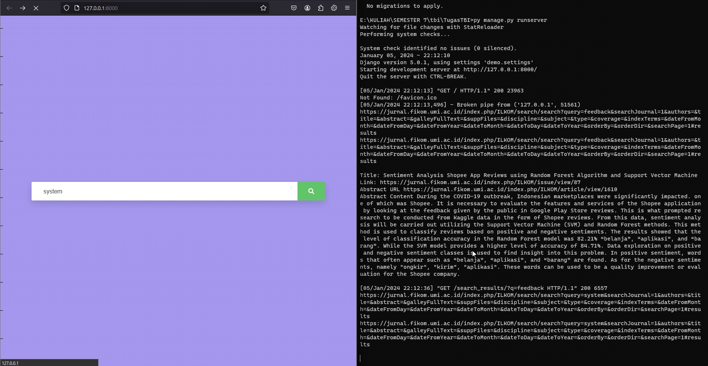

# TugasTBI Kelompok 3

## Dataset Preparation

### Instalasi program 

```
pip install django
pip install mysqlclient
```

### Running program scraping
 
- Buat database mysql dengan nama 'jurnal' 
- Jalankan perintah berikut migrasi untuk membuat struktur tabel dan menjalankan program scraping jurnal : 

```
py manage.py makemigrations
py manage.py migrate
py manage.py runserver
```

- preview :



## Sistem Temu Balik Informasi 

### Cara kerja sistem (Workflow) 

.... 
...